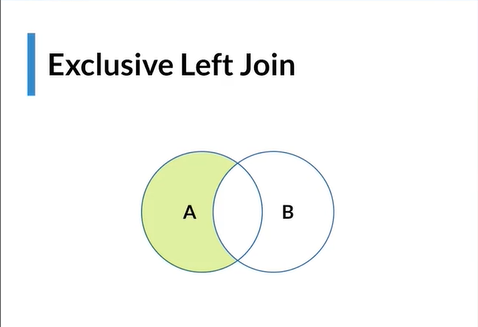
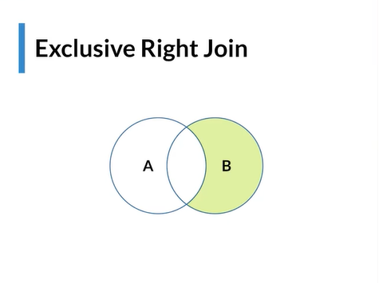
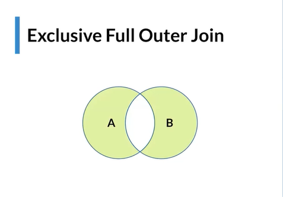
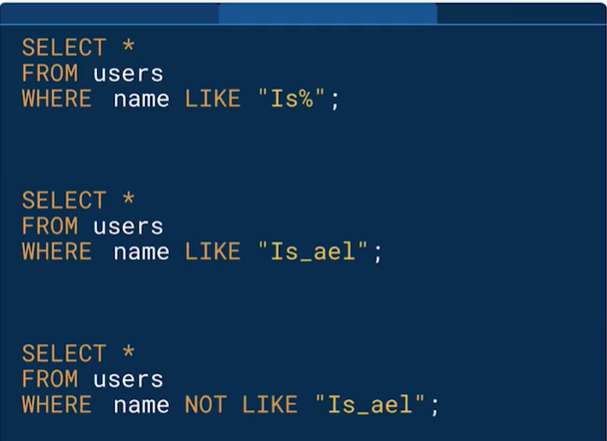

## **Base de Datos**
### **Exclusive  Left Join**


> `Traer todos los elementos que existan en A `,donde nos aseguremos que  no existan en en la tabla  B.

> Ejem: Tenemos 2 categorias que se solapan : Equipos de computo y electronica , `necesito solo necesito los productos de electronica `que no tengan que ver con computo.

### **Exclusive Right Join**


### **Full Outer Join**
> Traer todos los elementos de ambas tablas.

>Trae todo contra todo y multiplicalo: `Elemento N°1 de la tabla A con el elemento numero 1 de B, elemento 1 de A con el elemento 2 B, elemento 1 A con elemnto n de B`.

### **Exclusive Full Outer Join**

> - Trae lo que existe en A y en B pero `No lo que tienen en comun`.
> Ejem: Deseo traer  por un lado productos  de electronica y por el otro solo de  computacion.No me intersa lo que tienen en comun(Lo que es de electronica y computacion al mismo tiempo).

### **LIKE**

> 1. Trae todos los elementos que `empiezen con Is%`(% indica que despues de esa cadena ,puede contener lo que sea)
> 2. Tra a todos los usuarios que  `contengan "Is_ael"`(- comodin que indica que ese espacio puede variar ejem: **`Is`m`ael`**, **`Is`r`ael`**)
> 3. traer todas las cadenas que no tengan este patron `Is_ael`.

### **Inices**
> Cuando hay campos muy complejos , en donde  se requiere ordenar por fecha,precio y ademas nombre. Volviendose un indice complicado.

> Para evitar ello se utilizan los `Indices`(se idexan,mapeando cada dato de la columna).

> Ejem:  Si se tienen palabras con `Aa` ocupara el lugar 1, `Ab` ocupa el lugar 2 , `B` el lugar 3. Que pasa si llega una palabra `Ac` , habra que `indexar nuevamente` quedando  en el siguiente orden : `Aa`,`Ab`,`Ac`,`B`,

> - Exelentes para busquedas y ordenamientos.

> - Es recomendable usarlo  en tablas donde se  realizan muchas busquedas , ucarlas en el Join o en el Order By .

> - Cuidar para alta transaccionabilidad.(`No es bueno tener inices en tablas donde se realizan muchas inserciones o actualizaciones`).

### **Agregacion | Group By**

> Reducir los datos en grupos.`Agrupar por criterios especificos.`

> Util : estadisticas , graficos,etc.

```
/*Quiero saber por marca X cosa**/

SELECT*
FROM tabla_diaria
GROUP BY marca;

```
¿Cual es el precio promedio por marca?

- se utilizara el `SELECT AVG(precio)` .
- Utilizas `GROUP BY marca` .Lo que hace :
     - lista las marcas  existentes y se agrupan (Asus, HP, Lenovo)
     - Suma los precios y saca el promedio  de los precios de cada uno de los grupos y te los muestra: Asus: 40, HP: 20 ,Lennovo:50
- Con el `Gruop By` indicas con que `criterio se armaran los grupos`.
- Con el `select` indicas que es `lo quieres saber de los grupos formados`(suma,promedio,etc).


